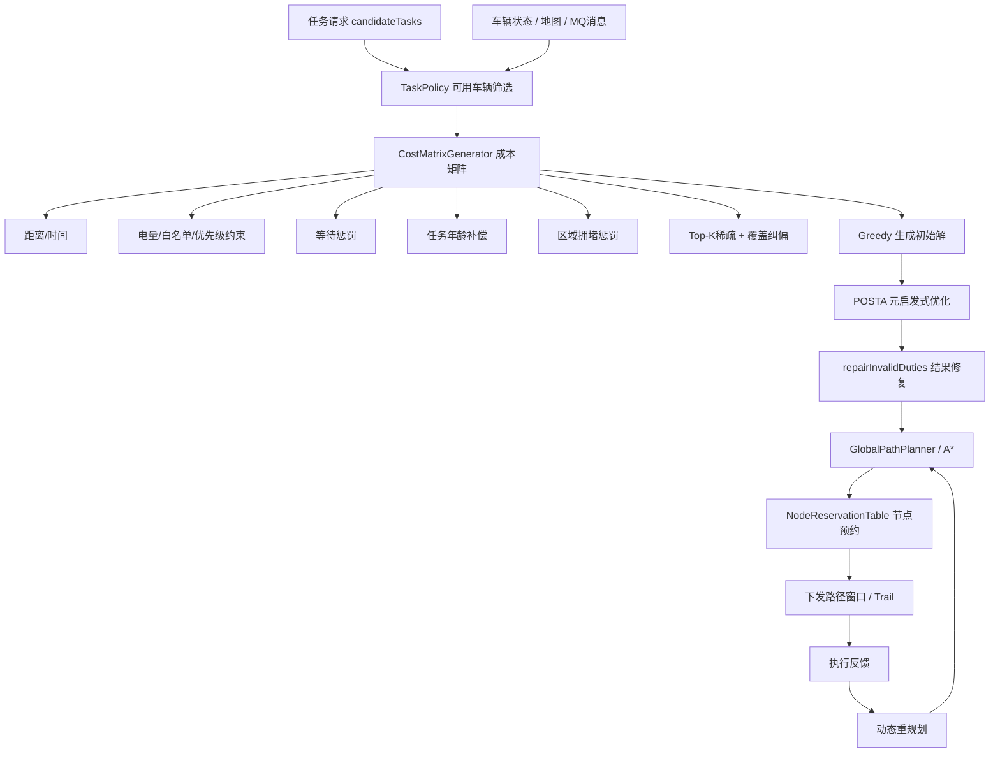
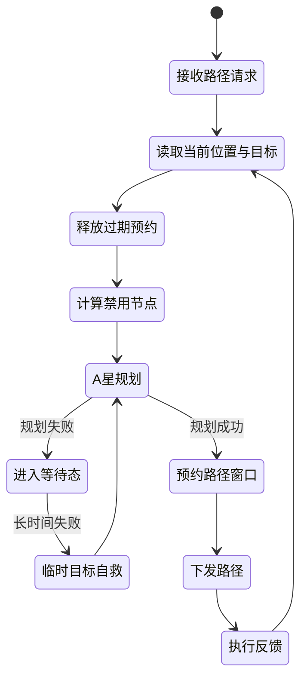
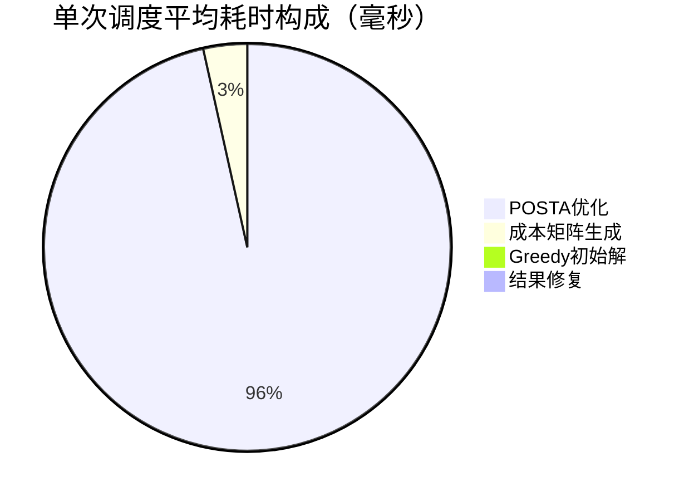
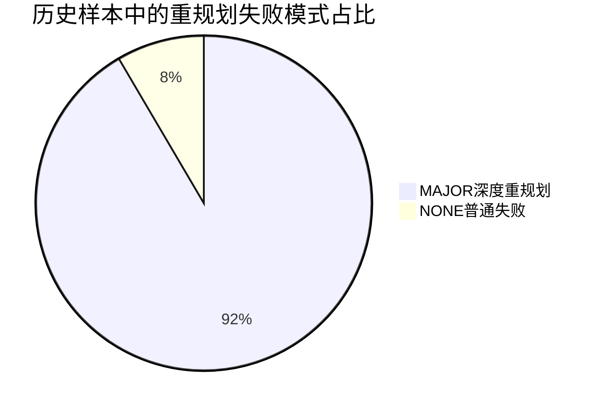
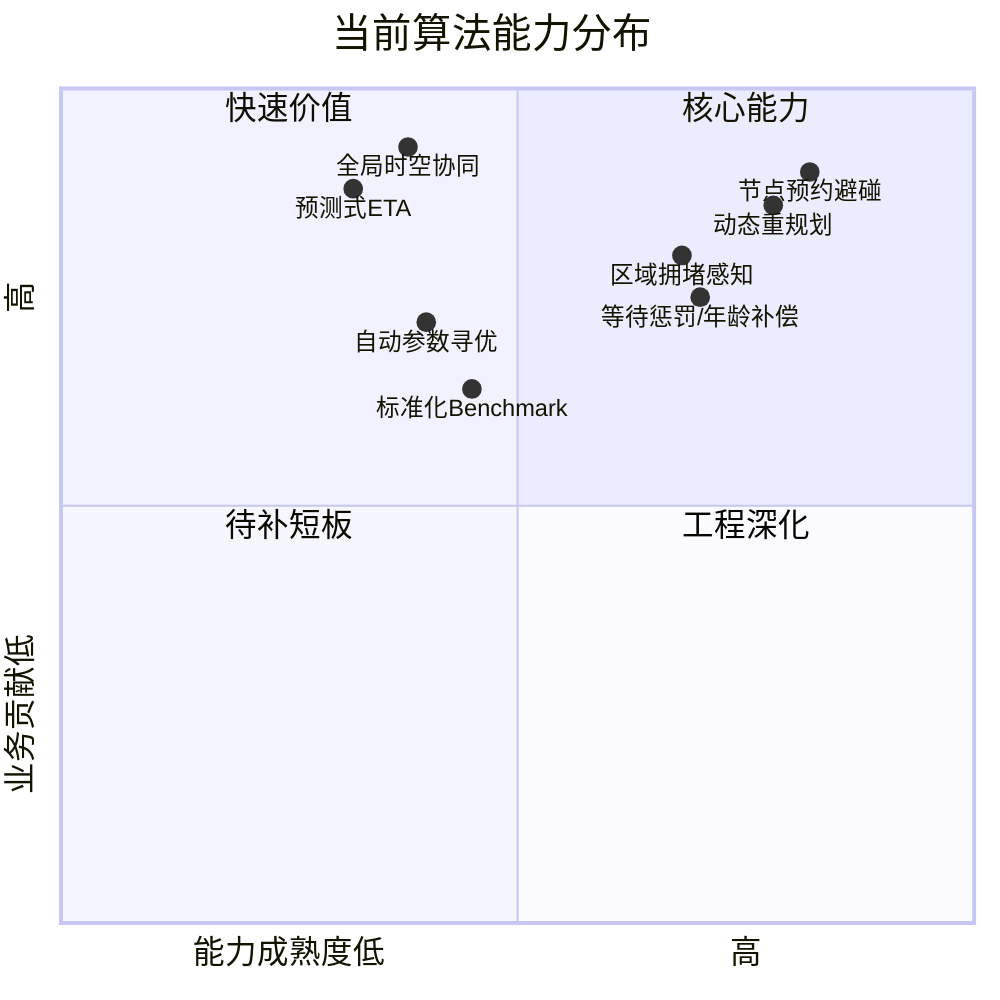
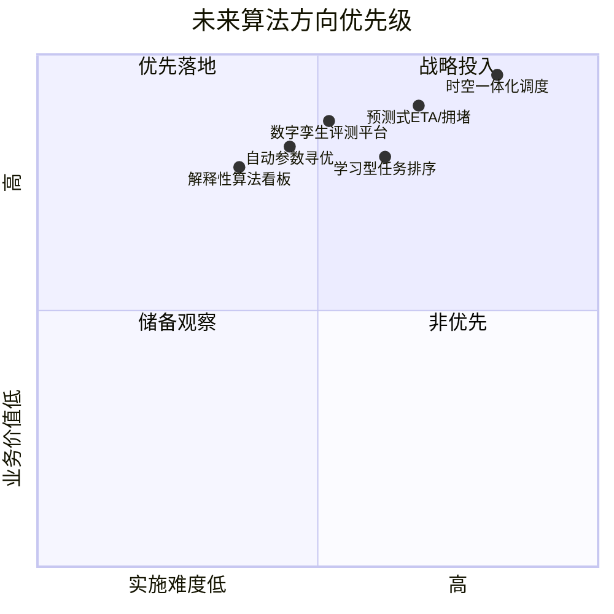
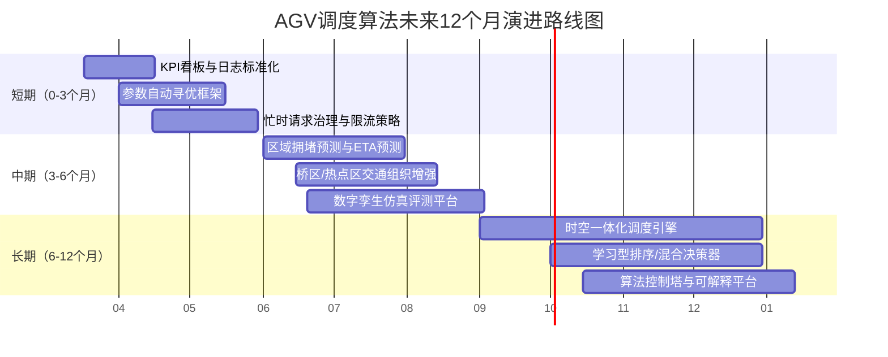

# AGV集群调度算法专题汇报

**汇报对象**：管理层 / 项目负责人  
**汇报日期**：2026-03-17  
**项目版本**：`agv_cluster_scheduling_intergration_v200`  
**材料口径**：基于当前源码、现有技术文档，以及历史样本日志 `debug/external_receiver_20260205_235905.log`

> 说明：本文重点面向“领导汇报”，强调算法能力、业务价值、当前短板和未来发展方向。文中“历史样本数据”用于辅助判断趋势，不等同于正式压测报告。

---

## 1. 一页结论

### 1.1 核心判断

1. **当前系统已经不是单一最短路调度，而是形成了“任务分配 + 路径规划 + 交通协调 + 动态重规划”的算法闭环。**
2. **现阶段主要瓶颈不在“算得慢”，而在“拥堵场景下的冲突处理、可参与调度车辆不足、重规划频繁”。**
3. **算法已经具备向更高阶智能调度演进的基础，包括等待惩罚、任务年龄补偿、区域拥堵感知、桥区识别、节点预约和临时目标自救。**
4. **下一阶段建议从“规则驱动”升级为“预测驱动 + 时空一体化 + 仿真驱动优化”的路线。**

### 1.2 建议领导层关注的三句话

- **短期看交付**：当前算法已经能支撑多AGV协同调度，具备较好的实时性和工程落地性。  
- **中期看效率**：继续优化拥堵区、桥区和重规划机制，可明显提升整体吞吐和稳定性。  
- **长期看壁垒**：如果升级到时空一体化调度、预测式拥堵控制和数字孪生仿真，将形成更强的算法竞争力。  

---

## 2. 当前算法总体架构

### 2.1 从管理视角看，当前算法有四层能力

| 能力层 | 当前做法 | 业务价值 |
|---|---|---|
| 任务分配 | Greedy + POSTA | 在可用时间内快速给出较优解 |
| 成本建模 | 时间、等待、年龄、拥堵、电量、白名单等多因素 | 不只追求最近任务，更关注全局效率 |
| 交通协调 | 节点预约、冲突排除、距离冲突组 | 降低并发碰撞和死锁风险 |
| 动态恢复 | 临时目标、自救重规划、承诺边保护 | 提高异常和拥堵场景下的恢复能力 |

### 2.2 当前算法能力定位

| 维度 | 当前水平 | 说明 |
|---|---|---|
| 实时性 | 强 | 历史样本中调度模块耗时较低 |
| 安全性 | 强 | 已具备预约避碰和重规划机制 |
| 公平性 | 中上 | 已有等待惩罚、任务年龄补偿 |
| 全局最优性 | 中 | 仍以启发式/元启发式为主 |
| 可解释性 | 中上 | 成本项和诊断日志比较丰富 |
| 可扩展性 | 中上 | 已具备继续接入预测/学习模块的接口空间 |

---

## 3. 算法核心设计

## 3.1 任务分配算法

### 当前实现

- **Greedy**：负责快速构造初始解，保证系统在短时间内先有“可用解”。
- **POSTA**：在 Greedy 基础上继续做 swap / shift / sym 搜索，提升任务序列质量。
- **结果修复**：对不可达、续航超限、detour过大等情况进行修复，避免输出非法解。

### 当前调度目标已经不再是“谁近谁上”

当前源码里，成本矩阵已经综合考虑了以下因素：

| 成本因子 | 是否已实现 | 作用 |
|---|---|---|
| 行驶时间 / 服务时间 | 是 | 基础效率目标 |
| 电量、设备白名单、任务优先级门槛 | 是 | 保障任务合法性 |
| 等待时间惩罚 `ALLOC_WAIT_PENALTY_COEFF` | 是 | 缓解任务长期等待 |
| 任务年龄补偿 `ALLOC_TASK_AGE_*` | 是 | 对“老任务”进行成本减免 |
| 区域拥堵惩罚 `ALLOC_CONGESTION_PENALTY_RATIO` | 是 | 减少车辆继续涌入拥堵区域 |
| Top-K 稀疏计算 + 覆盖纠偏 | 是 | 提升计算速度并避免远任务长期被忽略 |

### 领导可理解的算法价值

- **Greedy解决“先分出去”**  
- **POSTA解决“分得更好”**  
- **等待惩罚/年龄补偿解决“不能老让某些任务饿死”**  
- **拥堵惩罚解决“不能把所有车都压到一个热点区域”**

## 3.2 路径规划与交通协调

### 当前实现

- **A\***：作为底层路径搜索核心。
- **NodeReservationTable**：对节点进行并发预约，避免多车抢占同一路径点。
- **距离冲突组**：不仅判断“同一个点”，还可把“距离太近的点”视为互斥资源。
- **动态重规划**：当目标不可达、窗口被占、场景拥堵时，触发重规划。
- **临时目标机制**：当车辆长期无法直达真实目标时，先引导车辆退出拥堵区。

### 当前路径算法的业务含义

- **不是一次性把整条路全发出去**，而是发“预约到的安全窗口”。  
- **不是撞了再处理**，而是在路径生成阶段就尽量规避冲突。  
- **不是规划失败就卡死**，而是允许车辆先退让、绕行、临时避堵。  

---

## 4. 当前算法亮点

## 4.1 从“局部最短”走向“多因素综合调度”

过去很多AGV系统只做最近任务匹配，容易出现局部最优和区域饥饿。当前系统已经在源码层面加入：

- 等待时间惩罚
- 任务年龄补偿
- 区域拥堵惩罚
- 桥区识别和特殊限流
- Top-K覆盖纠偏

这意味着系统开始具备“公平性 + 吞吐率 + 稳定性”综合平衡能力。

## 4.2 图表：当前调度模块平均耗时构成

数据来源：历史样本日志 `debug/external_receiver_20260205_235905.log`，共统计 **50 次调度运行**。

### 解读

- **主耗时集中在 POSTA 优化阶段**，说明系统已经把更多算力用在“解质量提升”而不是“基础建模”上。
- **成本矩阵构建非常快**，说明稀疏 Top-K 机制是有效的。
- **Greedy 和修复阶段耗时极低**，能保证系统先快速有解。

## 4.3 图表：历史样本运行概览

| 指标 | 历史样本结果 | 管理解读 |
|---|---:|---|
| 调度运行次数 | 50 | 有一定样本量，可观察趋势 |
| 平均参与AMR数 | 1.28 | 非紧急场景下，真正进入调度的车较少 |
| 平均任务数 | 2.12 | 该样本以小批量调度为主 |
| 参与过日志的AGV总数 | 30 | 系统覆盖的车规模已不小 |
| `plan failed` 次数 | 237 | 路径层面冲突/拥堵仍较频繁 |
| `scheduling busy, drop request` 次数 | 31 | 调度忙时存在请求丢弃风险 |
| 平均每轮被过滤掉的忙碌AGV | 28.72 台 | 非紧急场景下，大部分工作中车辆不会参与重调度 |

### 关键判断

**当前瓶颈更像“交通与拥堵问题”，不是“调度算得慢”。**

## 4.4 图表：重规划失败模式占比

### 解读

- 大部分失败已经进入 **MAJOR** 模式，说明系统在主动尝试更强的恢复动作。  
- 这也反向说明：**复杂拥堵区的交通协调仍是后续优化重点**。  

## 4.5 图表：当前算法优势与瓶颈

---

## 5. 当前问题与管理风险

### 5.1 算法层面

1. **分配与路径仍是“分层优化”**  
   当前是先分配、再路径规划、再重规划，还不是完整的时空一体化全局优化。

2. **交通冲突主要在节点级处理**  
   当前预约机制偏节点资源层面，未来还可以升级到边冲突、时间窗冲突和走廊级冲突管理。

3. **大量工作中车辆在非紧急场景下不参与重调度**  
   对系统稳定有好处，但可能降低全局吞吐率和任务响应速度。

4. **参数较多，调优依赖经验**  
   等待惩罚、区域窗口、桥区规则、预约窗口长度等，都需要进一步数据化治理。

### 5.2 工程层面

1. **存在 busy drop request**  
   忙时丢请求会带来业务层面对算法稳定性的质疑。

2. **路径失败频次较高**  
   说明复杂拥堵场景下，还需要更强的交通组织策略。

3. **缺少标准化算法基准体系**  
   当前日志很丰富，但还没有形成统一的 KPI 看板和自动化评测集。

---

## 6. 算法未来发展方向

## 6.1 方向一：从“启发式调度”升级到“时空一体化调度”

### 当前状态

- 任务分配和路径规划是串行衔接
- 重规划在执行中兜底

### 下一步目标

- 把“任务分配 + 路径资源 + 时间窗口”放进同一优化框架
- 让系统在分配阶段就预估路径拥堵和冲突代价

### 预期收益

- 明显减少重复重规划
- 提升高密度场景下的吞吐率
- 降低桥区/热点区死锁概率

## 6.2 方向二：从“规则感知”升级到“预测感知”

### 可以演进的能力

- ETA预测
- 拥堵趋势预测
- 热点区域提前限流
- 任务完成时间概率预测

### 业务价值

- 提前规避拥堵，而不是拥堵后再处理
- 让调度更像“交通控制中心”，不是“事后救火”

## 6.3 方向三：从“人工调参”升级到“自动调优”

### 建议建设内容

- 建立标准仿真场景库
- 固定 KPI：任务完成率、平均等待、P95延迟、重规划率、拥堵率
- 用仿真自动搜索最佳参数组合

### 业务价值

- 降低对核心算法工程师经验的依赖
- 参数升级更可控，风险更小

## 6.4 方向四：从“单次优化”升级到“学习型调度”

### 可选路径

- Learning to Rank：学习任务排序优先级
- 学习型成本修正：自动修正不同区域、不同时间段的代价
- 强化学习：在仿真环境中学会更优的车流组织

### 适用策略

- **短期不建议直接替代现有规则算法**
- **建议先以“规则算法 + 学习型打分器”的混合模式演进**

## 6.5 方向五：建设数字孪生与算法控制塔

### 目标

- 调度、路径、拥堵、车辆状态形成统一可视化
- 让算法效果从“看日志”变成“看看板”

### 价值

- 方便领导层看到算法投资带来的业务收益
- 便于售前、交付、运维形成统一口径

---

## 7. 图表：未来方向优先级

### 推荐排序

1. **优先落地**：自动参数寻优、解释性算法看板、数字孪生评测平台  
2. **战略投入**：时空一体化调度、预测式ETA/拥堵、学习型任务排序  

---

## 8. 图表：建议路线图

---

## 9. 管理层建议

### 建议一：近期投入应放在“交通治理”和“评测治理”

原因：

- 现阶段不是算力瓶颈，而是拥堵与冲突瓶颈
- 没有统一 KPI 和评测体系，就很难稳定提升算法

### 建议二：中期形成“仿真驱动”的算法迭代机制

原因：

- 未来算法参数会越来越多
- 需要把优化工作从“人工经验调参”变成“数据驱动迭代”

### 建议三：长期打造“算法壁垒”

重点：

- 时空一体化调度
- 预测式交通组织
- 学习型排序与混合决策

这三项如果打通，会让系统从“能用”走向“难替代”。

---

## 10. 可直接汇报的话术

### 10.1 30秒版本

“当前AGV调度算法已经形成了从任务分配、路径规划到交通协调和动态重规划的完整闭环。现在的主要矛盾不是算法算得不够快，而是在复杂拥堵场景下，如何进一步减少冲突和重复重规划。下一阶段建议重点投入时空一体化调度、拥堵预测和数字孪生评测平台，形成更强的算法竞争力。”

### 10.2 2分钟版本

“从源码和现有运行情况看，我们现在的算法已经不只是简单的最近任务匹配，而是加入了等待惩罚、任务年龄补偿、区域拥堵惩罚、桥区识别、节点预约和动态重规划等机制。历史样本日志显示，调度计算本身耗时并不高，主要耗时集中在POSTA优化阶段，而且总体仍在可控范围内。真正值得继续发力的，是复杂场景下的交通组织能力。未来我们建议分三步走：第一步，建立统一KPI和自动调参机制；第二步，上预测式ETA和拥堵控制；第三步，升级到时空一体化调度和学习型混合决策。”

---

## 11. 附录：本次材料引用的关键事实

- 任务分配：Greedy + POSTA + repairInvalidDuties
- 成本项：等待惩罚、任务年龄补偿、区域拥堵惩罚、Top-K覆盖纠偏
- 路径层：A* + NodeReservationTable + 动态重规划 + 临时目标
- 历史样本：`debug/external_receiver_20260205_235905.log`
- 历史样本统计：
  - 调度运行 50 次
  - 单次平均耗时：成本矩阵 2.386 ms，Greedy 0.022 ms，POSTA 66.116 ms，修复 0.010 ms
  - `plan failed` 237 次
  - `scheduling busy, drop request` 31 次
  - 平均每轮被过滤掉的忙碌AGV 28.72 台

---

## 12. 最终判断

**当前系统已经具备“可落地、可演进、可形成壁垒”的算法基础。**  
如果下一阶段继续把算法升级重心放在 **交通治理、预测能力、时空一体化和数字孪生评测** 上，项目的算法能力会从“工程实现”进一步走向“平台竞争力”。
